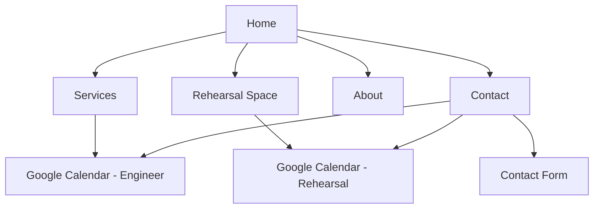

# Sound Engineer Website — Build Plan

**Project folder:** `Josh-website`  
**Stack:** Next.js + React + TypeScript + Tailwind CSS  
**Booking:** Google Appointment Schedules (2 calendars, embedded)  
**Deploy:** Vercel + custom domain (optional at first)

---

## Phase 0 — Gather inputs (before coding)

Get this from the sound engineer (or use placeholders and swap later).

### Brand & content

- [ ] Studio / business name
- [ ] Short tagline (e.g. "Recording · Mixing · Mastering · Lessons")
- [ ] Bio (2–3 paragraphs)
- [ ] Professional photos (studio, gear, him at work)
- [ ] Portfolio / credits (artists, albums, projects)
- [ ] Service descriptions + indicative pricing (or "on request")
- [ ] Rehearsal space: capacity, equipment, rules, hourly rate
- [ ] Equipment rental list (if shown on site)
- [ ] Contact: email, phone, address / city, social links
- [ ] Cancellation & booking policy (short text)

### Google Calendar (he does this in his Google account)

- [ ] **Calendar 1 — Engineer sessions**  
  Types: recording, mixing, mastering, lessons, production coaching
- [ ] **Calendar 2 — Rehearsal space**  
  Room-only bookings
- [ ] Appointment Schedules for each (duration, buffers, availability hours)
- [ ] Embed URLs or booking links from Google Calendar

### Your decisions

- [ ] Project folder name: `Josh-website` ✓
- [ ] Language: French, English, or bilingual
- [ ] Color vibe (dark studio aesthetic vs clean minimal)

**Gate:** You can start Phase 1 with placeholders; real copy/photos can land in Phase 4.

---

## Phase 1 — Project foundation (Session 1, ~2–3 h)

### 1.1 Scaffold

- Create Next.js app (App Router, TypeScript, Tailwind, ESLint)
- Folder structure:

```
app/
  page.tsx              # Home
  services/page.tsx
  rehearsal/page.tsx
  about/page.tsx
  contact/page.tsx
  layout.tsx
components/
  Header.tsx
  Footer.tsx
  Hero.tsx
  ServiceCard.tsx
  BookingEmbed.tsx
  ContactForm.tsx
lib/
  site-config.ts        # name, links, services (single source of truth)
public/
  images/
```

### 1.2 Global layout

- Header: logo/name, nav, "Book a session" CTA
- Footer: contact, social, legal links
- Mobile menu
- Shared typography + spacing (Tailwind)

### 1.3 Config-driven content

- `site-config.ts`: services, nav links, calendar URLs, contact info
- Easier for the engineer to update later without touching every page

**Deliverable:** App runs locally, navigation works, placeholder content on all pages.

---

## Phase 2 — Core pages (Session 2, ~2–3 h)

### 2.1 Home (`/`)

- Hero: name, tagline, primary CTA → engineer booking
- Services overview (6 cards)
- Short "Why work with me"
- Portfolio teaser
- Secondary CTA → rehearsal booking
- Optional: testimonial / client logos strip

### 2.2 Services (`/services`)

- Sections: Recording, Mixing, Mastering, Lessons, Equipment rental
- Each: description, what's included, duration hints, "Book" → engineer calendar
- Equipment rental: list + "Contact for availability" if not calendar-based

### 2.3 Rehearsal space (`/rehearsal`)

- Photos, specs, rules (noise, max people, gear in room)
- Pricing
- **Book rehearsal space** → second calendar embed / link

### 2.4 About (`/about`)

- Bio, experience, gear highlights, credits

### 2.5 Contact (`/contact`)

- Email, phone, map or address
- Simple contact form (name, email, message, service interest)
- Links to both booking flows

**Deliverable:** Full site structure with real layout; copy/images can still be placeholders.

---

## Phase 3 — Booking integration (Session 3, ~1–2 h)

### Option A implementation (chosen)

**Per calendar:**

1. In Google Calendar → Appointment Schedules → create schedule
2. Set availability, slot length, buffers, timezone
3. Copy embed code or public booking URL

**On the site:**

- `BookingEmbed.tsx`: iframe or prominent button opening Google booking page
- **Engineer bookings:** `/services`, `/contact`, home CTA
- **Rehearsal bookings:** `/rehearsal` only
- Short note: "You'll receive a confirmation by email"

### UX rules

- Two clear labels: "Book studio time with [Name]" vs "Book rehearsal space"
- Never mix both on one page without explaining the difference
- Test on mobile (Google embeds are often better as "Open booking" link on small screens)

**Deliverable:** Both calendars wired; test booking end-to-end in his Google account.

---

## Phase 4 — Polish & production readiness (Session 4, ~1–2 h)

### Design polish

- Consistent dark/neutral studio palette + one accent color
- Image optimization (`next/image`)
- Hover states, section spacing, readable type on mobile

### SEO & meta

- Per-page `title` / `description`
- Open Graph image (studio photo or simple branded graphic)
- `sitemap.xml`, `robots.txt` (Next.js can generate)

### Contact form

- API route + email (Resend, SendGrid) **or** Formspree for zero-backend
- Honeypot or basic spam protection

### Legal / trust

- Footer: cancellation policy (link or section)
- Optional: simple privacy note if form stores data

### Analytics (optional)

- Plausible or Google Analytics

### Deploy

- Push to GitHub → connect Vercel
- Custom domain when ready

**Deliverable:** Live URL, Lighthouse pass on basics, forms and bookings tested.

---

## Suggested page map



---

## Session checklist (with AI help)

| Session | Focus | Outcome |
|---------|--------|---------|
| **1** | Scaffold + layout + config | Runnable app, nav, placeholders |
| **2** | All pages + content structure | Complete site skeleton |
| **3** | Calendar embeds + contact form | Booking works for real |
| **4** | Polish, SEO, deploy | Production site live |

**Total active build:** ~6–10 hours  
**Calendar + content from engineer:** add 0.5–2 days wall-clock time

---

## What to do first when starting Session 1

1. Confirm **project name**, **language**, and **where to create the repo** (`~/Desktop/Josh-website`)
2. Scaffold Next.js + Tailwind
3. Add `site-config.ts` with placeholder content
4. Build layout + home page
5. Iterate page by page

---

## Nice-to-haves (post-v1)

- Blog / news ("New rehearsal room gear")
- Audio samples / Spotify embeds on portfolio
- Stripe deposits for rehearsal
- Admin CMS (Sanity) so he edits copy himself
- Custom booking UI (Option B) if Google embeds feel too limited

---

## Risks to watch

| Risk | Mitigation |
|------|------------|
| No photos yet | Placeholder images + swap in `public/images/` |
| Calendar not ready | Temporary "Contact to book" buttons |
| Equipment rental doesn't fit calendars | Contact form + manual follow-up |
| Embed ugly on mobile | Use "Book now" button → opens Google in new tab |

---

## Timeline summary

| Milestone | Focused work (you + AI) | Spread over evenings/weekends |
|-----------|-------------------------|----------------------------------|
| **MVP** — Home, services, rehearsal page, contact, 2 calendar embeds, mobile-friendly | **1–2 days** | **~1 week** |
| **Polished v1** — custom look, animations, SEO, legal pages, form + deploy | **3–5 days** | **~2 weeks** |

**Best case** (assets ready, few revision rounds): **1 weekend**  
**Typical** (some back-and-forth): **~1–2 weeks** part-time  
**Polished + client delays**: **2–3 weeks** calendar time
